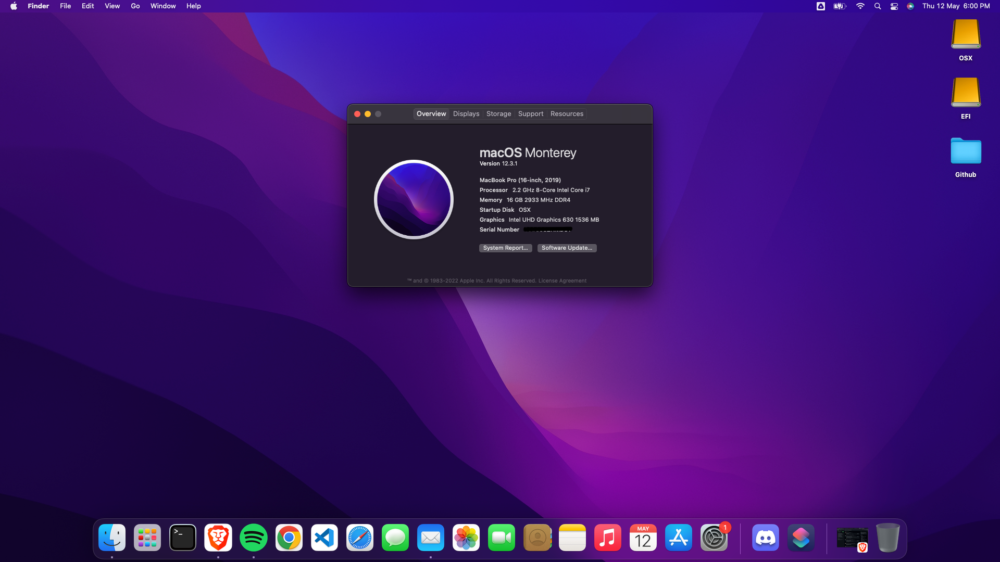
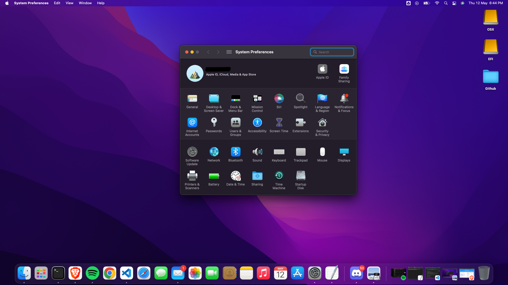

# Acer Predator Helios 300 PH315-53 Monterey

 macOS Monterey on Acer Predator Helios 300 PH315-53 with OpenCore 8 EFI folder.

 # Screesnshots

 <a href=""> </a>

 <a href=""> </a>

## Configuration

| Specifications      | Details                                            |
| ------------------- | -------------------------------------------------- |
| Laptop Model        | PH315-53                                     |
| Processor           | Intel® Core™ i7-10870H                              |
| Graphics            | Intel® UHD Graphics 630 & Nvidia GeForce® RTX 3060 |
| RAM                 | 16GB DDR4-2666Mhz                                  |
| Disk                | NVMe WDC PC SN730 SDB 256 GB SSD & WDC WD10SPSX-21A6WT0 1 TB HDD      |
| Wifi                | Killer(R) Wi-Fi 6 AX1650i 160MHz Wireless Network Adapter (201NGW)                   |
| Ethernet            | Killer E2600 Gigabit Ethernet Controller        |

## What's working

- [x] Audio (Input & Output)
- [x] Webcam
- [x] iGPU
- [x] ACPI Display brightness
- [x] Ethernet
- [x] Sleep + Wake
- [x] Smart Touchpad + Gestures
- [x] WiFi (2.4Ghz and 5GHz)
- [x] Native hotkey support with Fn keys
- [x] iServices (Messages, FaceTime, etc.)

## What's not working

- [ ] GTX 1650 (macOS does not support recent Nvidia GPUs).
- [ ] HDMI port (since it's connected to the GTX 1650).

If you still want to use an external monitor, you can by a USB 3.0 to HDMI adapter.
<a href="https://www.amazon.in/dp/B013G4CJM8/?coliid=I21IXZ0W5ZAFHX&colid=IWBALZYIADBW&psc=0&ref_=lv_ov_lig_dp_it">Amazon.in</a>

## Installation

### How To Install

- Format your USB "non-bootable" using RUFUS and delete any leftover in USB(autoruns).
- Paste com.apple.recovery.boot & EFI in USB.
- Download [GenSMBIOS](https://github.com/corpnewt/GenSMBIOS) to generate unique SMBIOS information. Run it and select Generate SMBIOS, as model sekect MacBookPro16,4.
- Open config.plist with [ProperTree](https://github.com/corpnewt/ProperTree) and go to platforminfo > Generic. Set MLB( Board Serial), SystemSerialNumber(Serial), and SystemUUID (SmUUID) to generate values.
- Boot it!.

### First-time installation

- Set-up the BIOS configuration:
  - Boot to BIOS by pressing F2 during boot.
  - In the Main screen, enable F12 boot menu, disable Fast Boot, then press Ctrl+S and change the new SATA mode option to AHCI.
  - In the Boot screen, disable secure boot.
  - Finally, go to the Exit screen and select "Exit saving changes".
- Read through the following tutorial to create a bootable USB, and then place the EFI folder inside it:
   - https://dortania.github.io/OpenCore-Install-Guide/
- You should add Serial Number, UUID, MLB and ROM details to Config -> PlatformInfo -> Generic if you want to get iServices working as explained [here](https://dortania.github.io/OpenCore-Post-Install/universal/iservices.html).

### Post Install
- Clone the [ComboJack repo](https://github.com/hackintosh-stuff/ComboJack) and run the installer inside the `ComboJack_Installer` folder to get the jack port working correctly.
- Run the following commands for sleep wake:
  ```
  sudo pmset -a hibernatemode 0
  sudo pmset -a autopoweroff 0
  sudo pmset -a standby 0
  sudo pmset -a proximitywake 0
  ```
### Boot Wthout Installation Media

- Make a partition with name "EFI" of 200 MB in the drive where you have installed the OS.
- From your Bootable USB copy "EFI" folder and paste it in "EFI" Partition 
